# App Code and explanation

## Server.js

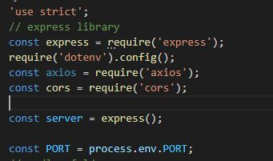

Here we have the express library, express is a Node.js web application framework that includes a full range of capabilities for both online and mobile apps.

We have some other things like dotenv so we can add the .env so our privet keys links doesn't get leaked, and so we can work on the local and the site at the same time without changing the website.

Axios so the server can get data from other server/links.

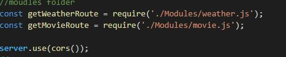

Here is where we call other functions that are in their own files we have here the weather.js and movie.js.

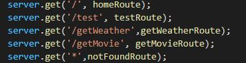

We have here the route for each server we have homeRoute, testRoute, weatherRout,movieRoute, and the errorRoute which is the notFoundRoute.

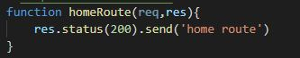

Here we have the home route for the server.

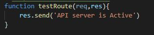

We have here the function for the test route.

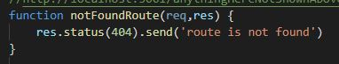

And here we have the function of the error page where if the user enters somthing not on this list it will send him a massage that this route is not found.

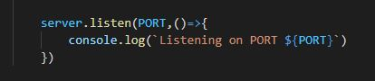

This is how we call out port either the local one or the published one.

------

## Weather.js

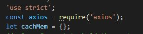

Here we use the axios to get the data we want so we can store it in our API.
For the weather

cachMem the Cache interface offers a long-term storage method for Request/Response object pairs that are cached in memory.

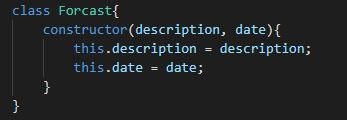

And this is the class for our weather.js and its called Forcast it have constructor with two parameters and they are description and date.

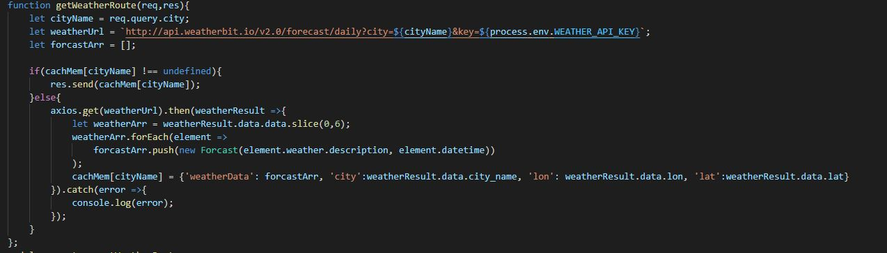

This is the function for the weather.js where we get the info we want like the description and date from the website we want, we put them in array of six days, and we get the name of the city and the longitude and latitude for that city.

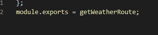

This is how we export this weather server so the main server can get the data from.

------

## Movie.js

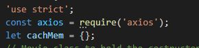

Here we use the axios to get the data we want so we can store it in our API.
For the movie

cachMem the Cache interface offers a long-term storage method for Request/Response object pairs that are cached in memory.

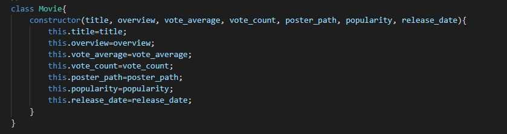

Here we have the class for the movie which is called Movie that contains title, overview, vote_average, vote_count, poster_path, popularity, release_date.

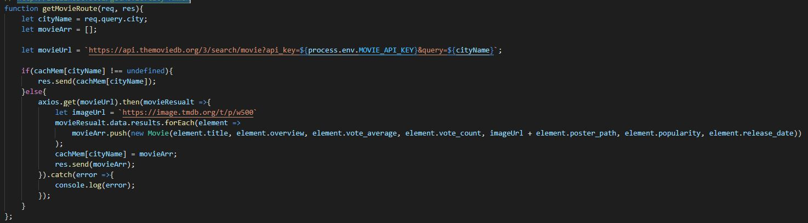

This is the function of the Movie server it has an array so it can take all the movie that we searched for, and I added the image Url so we can see the poster for that movie.

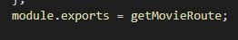

This is how we export this movie server so the main server can get the data from.
